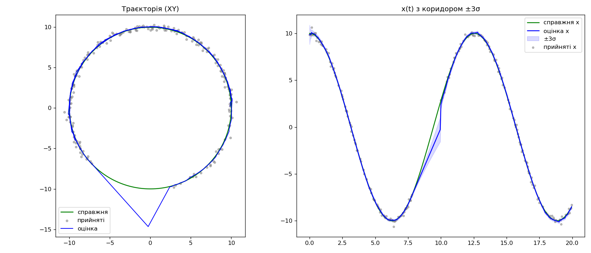
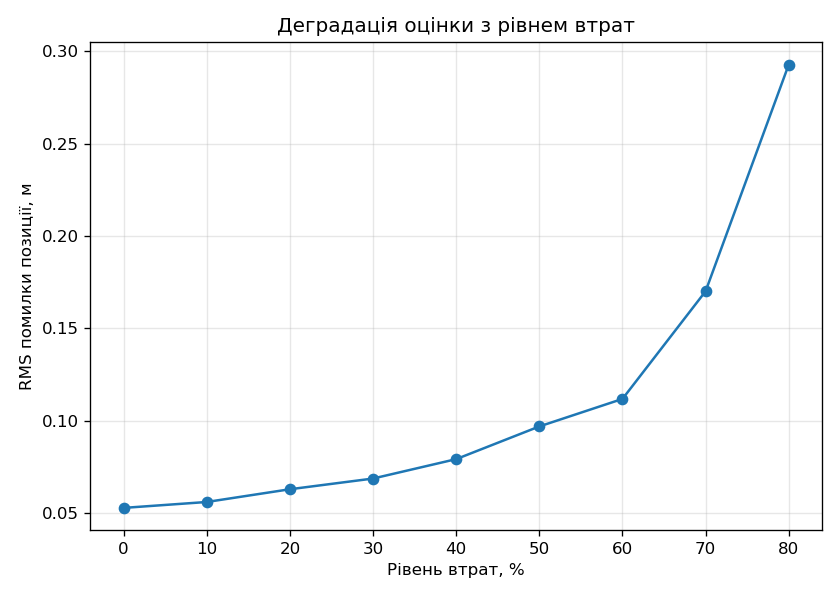
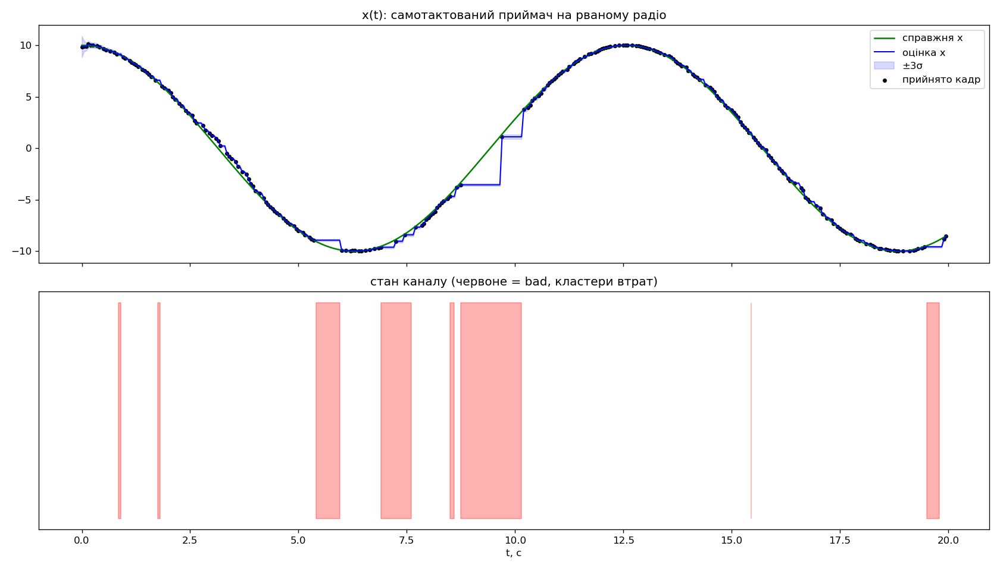

# Надійний транспортний рівень телеметрії з компенсацією втрат

Навчальний модуль транспортного рівня для телеметрії дрона / наземного роботизованого
комплексу поверх одного послідовного каналу (UART). Ядро — platform-agnostic C++20 без
системних викликів, придатне до перенесення на мікроконтролер; уся взаємодія із «залізом»
винесена за тонкий HAL-інтерфейс.

## Теза

> **Надійність доставки — це властивість повідомлення, а не каналу.**

Телеметрію дрона повторно передавати шкідливо: повтор приходить через ~2×RTT, коли дані вже
застаріли. **Пізній пакет гірший за відсутній.** Команди оператора, навпаки, мають доходити
гарантовано й рівно один раз. Отже один фізичний UART обслуговує два принципово різні режими
доставки. Наслідок: втрати телеметрії лікуються не ретрансмісією, а **передбаченням** —
фільтр Калмана на приймачі закриває прогалини `predict`-кроками.

## Проблема

Наївний «TCP поверх UART» ламається саме на телеметрії: гарантована доставка означає
ретрансмісію, а ретрансмісія означає, що на екран оператора потрапляє старий стан замість
свіжого. Для потоку позицій, що оновлюється десятки разів на секунду, це деградація, а не
надійність. Тому транспорт має розрізняти, **що** він несе, і застосовувати різну стратегію.

## Топологія системи

```
Політний контролер (джерело стану)
        │ UART
Радіомодуль на борту
        ╎ радіоканал  ← втрати виникають тут
Радіомодуль на землі
        │ USB, /dev/ttyUSB0
Наземна станція (ноутбук)  ← тут фільтр Калмана
```

Радіомодулі **прозорі для байтів**: обидва кінці бачать звичайний послідовний порт. Тому
`socat` (віртуальна пара `/tmp/ttyA ↔ /tmp/ttyB`) — коректна модель тієї ділянки, яку
прикладний код і так не бачить, а не спрощення. Фільтр Калмана живе на приймачі, бо
осліплений саме він; політний контролер має власну оцінку з повнорейтових датчиків.

## Архітектура

Ядро (фреймер, машина нумерації, фільтр) — **platform-agnostic C++ без системних викликів і
без `<iostream>`**: приймає байти й час, віддає оцінку. Тонкий HAL-інтерфейс
(`read_bytes`, `write_bytes`, `now_us`) має дві реалізації — POSIX/termios і мок для тестів.
Це дозволяє ганяти всі тести без заліза й обґрунтовано стверджувати портованість на STM32.

Карта модулів (шлях прийому знизу вгору):

| Модуль | Файли | Роль |
|---|---|---|
| COBS | `cobs.*` | кадрування без байта `0x00` всередині; межа — `0x00` |
| CRC16-CCITT | `crc16.*` | контроль цілісності |
| Серіалізація | `state_payload.*` | `StatePayload ↔ байти` (LE, вручну по полях) |
| Кадр | `frame.*` | збірка/розбір кадру, CRC над вмістом, обгортка COBS |
| Фреймер | `frame_reader.*` | накопичення байтів до межі, самосинхронізація |
| Нумерація | `seq_gap.*` | детекція прогалин за SEQ (mod 256) |
| Симулятор каналу | `channel_sim.*` | керовані втрати + інверсія бітів (сідований ГВЧ) |
| Фільтр | `kalman1d.*`, `kalman2d.*`, `mat2.hpp` | оцінка стану, `predict`/`update` |
| Приймач | `state_receiver.*` | байти → кадр → оцінка |
| HAL | `hal.hpp`, `mock_hal.*`, `posix_hal.*` | абстракція «заліза» |
| Траєкторія | `trajectory.*` | аналітична істина для експериментів |

## Формат кадру

Вміст кадру (до COBS):

```
[LEN][CLASS][SEQ][ACK][BITMAP][ payload×LEN ][ CRC:2 ]
 └──────────── CRC16 рахується над цим ─────┘
```

Далі весь вміст загортається в COBS, і межею кадру є байт `0x00`. `payload` для класу STATE —
фіксована структура `float32`:

```cpp
struct StatePayload {
    uint32_t timestamp_ms;
    float x, y;
    float vx, vy;
};
```

## Прийняті рішення та обґрунтування

- **COBS замість `AA 55 + LEN`.** COBS **математично гарантує** відсутність `0x00`
  всередині кадру, тому межа однозначна й машина станів для пересинхронізації не потрібна.
  Сигнатурний підхід такої гарантії не дає (сигнатура або поле довжини можуть трапитись у
  даних). Ціна COBS — один байт на кадр.
- **CRC до COBS.** CRC рахується над вмістом (заголовок + payload), і вже все разом
  кодується COBS. Так CRC захищає реальні дані, а COBS лишається чистим транспортом; якби
  CRC рахувався після COBS, його байти могли б містити `0x00` і ламати межу.
- **`dt` з бортової мітки часу**, а не з часу прибуття кадру: радіо віддає байти пачками,
  тому час прибуття не відображає час події. Правило: час події фіксується там, де подія
  сталася.
- **Втрата детектується за SEQ**, не за таймінгом і не за CRC. Кадр із розбіжністю CRC
  відкидається. Битий кадр і кадр, що не долетів, зводяться до одного факту —
  **уніфікація видів відмови**: розрив у номерах = кількість пропущених вимірювань.
- **Серіалізація по полях вручну**, не `memcpy` структури — щоб уникнути залежності від
  padding і порядку байтів конкретної платформи (`float` серіалізується через `std::bit_cast`).
- **Фільтр як два незалежні 1D-фільтри.** У моделі постійної швидкості з діагональними
  шумами осі `x` і `y` не зв'язані, тож 4-станний фільтр розкладається на два однакові
  2×2.

## Два класи обслуговування

|  | STATE | CMD |
|---|---|---|
| Напрямок | борт → земля | земля → борт |
| Частота | десятки Гц | рідко |
| Надійність | best-effort | ACK + retransmit |
| Втрата | закривається `predict`-кроком | закривається повтором |
| Дедуплікація | не потрібна | обов'язкова |

**Статус:** клас STATE та компенсація втрат реалізовані повністю (код, тести, експерименти).
Формат кадру вже містить поля `CLASS`, `ACK`, `BITMAP` під клас CMD, але сама машина повторів
CMD ще не реалізована — див. «Напрямки розвитку».

## Огляд існуючих рішень

- **MAVLink** — стандарт телеметрії дронів; кадр зі стартовим байтом, довжиною і CRC, багато
  типів повідомлень. Важкий для навчальної мети й не кодує напряму асиметрію надійності на
  рівні класу повідомлення.
- **TinyFrame** — легка C-бібліотека кадрування (SOF + len + type + id + CRC).
- **PacketSerial / SerialTransfer** — Arduino-орієнтовані бібліотеки, причому PacketSerial
  теж використовує COBS для меж кадрів.

Власна реалізація обрана з двох причин: навчальна цінність (розібратись у кадрах самостійно)
і те, що внесок роботи — не фреймінг як такий, а **модель двох класів надійності + компенсація
втрат оцінювачем**, чого готові фреймери не надають.

## Як зібрати й запустити

Середовище — devcontainer (Ubuntu 24.04: clang, cmake, ninja, GoogleTest) або будь-який хост
із C++20, CMake ≥ 3.20 і Ninja. GoogleTest підтягується автоматично через FetchContent.

```bash
make test    # усі юніт-тести (~50, GoogleTest)
```
```bash
make demo    # прогони experiment + rms + realtime -> CSV та графіки у docs/
```

`make demo` детермінований (фіксовані сіди), тож результат відтворюваний. Графіки малює
Python + matplotlib; якщо їх нема — демо не падає, лишаються CSV.

## Результати

**Якісний прогін** (`docs/experiment.png`): рух по колу, 40% випадкових втрат і навмисний
повний блекаут на `t ∈ [8,10] с`.



Точки телеметрії рідшають від втрат, але лінія оцінки лишається гладкою. Під час блекауту
фільтр іде лише на `predict`: оцінка коастить по інерції, а коридор ±3σ роздувається; після
відновлення зв'язку оцінка стрибком підтягується назад.

**Кількісний прогін** (`docs/rms.png`, `docs/rms.csv`): RMS помилки оцінки позиції залежно від
рівня втрат.



| Рівень втрат | RMS, м |
|---|---|
| 0% | ~0.053 (фільтр згладив шум вимірювання 0.2 м у ~4 рази) |
| 40% | ~0.079 (лише ~1.5× за втрати 40% даних) |
| 60% | ~0.112 |
| 70→80% | ~0.170 → ~0.293 (різкий злам) |

Пологість більшої частини кривої — і є число, що доводить тезу «телеметрія деградує плавно».
«Коліно» на 70–80% — межа CV-екстраполяції на задовгих прогалинах.



На відміну від якісного прогону, тут фільтр веде **тільки бортова мітка часу**: оцінка
оновлюється на кожен прийнятий кадр і **застигає між кадрами**. У кластерах втрат (червоні
смуги внизу) лінія оцінки йде сходинками — коастинг «до зараз» не робиться, тож після
завмирання оцінка стрибком підтягується до першого нового кадру. Гладкість оцінки попри
рвані інтервали доставки — наслідок того, що `dt` береться з мітки події, а не з часу
прибуття. Це і є характер приймача в реальному самотактованому режимі; згладжування між
кадрами для дисплея — окремий крок (див. «Напрямки розвитку»).

## Прошивка на STM32 (реальне залізо)

Ядро platform-agnostic, тож ті самі файли (`cobs`, `crc16`, `state_payload`, `frame`,
`trajectory`) компілюються й **під ARM Cortex-M4** без змін. У `firmware/` — проєкт для плати
**NUCLEO-F411RE**, згенерований STM32CubeMX (вивід CMake). Плата грає роль **борту
(передавача)**: генерує кругову траєкторію, пакує її **тим самим ядром** і шле STATE-кадри по
UART (`USART2` → ST-LINK Virtual COM Port, тобто по тому ж USB-кабелю, що й прошивка). Ноутбук
запускає приймач `rx` (`PosixHal` + `StateReceiver`), читає порт і будує згладжену оцінку.

Це підтверджує заявку про портованість: на борту працює лише нова реалізація
виводу байтів (`HAL_UART_Transmit`), решта — те саме незмінне ядро, що й у тестах/симуляції.

**Потрібно (на macOS-хості):** `arm-none-eabi-gcc` (напр. `brew install --cask gcc-arm-embedded`),
`stlink` (`brew install stlink`); STM32CubeMX — лише якщо треба перегенерувати проєкт.

### Прошити борт (з теки `firmware/`)
```bash
cmake --preset Debug && cmake --build build/Debug
```
```bash
arm-none-eabi-objcopy -O binary build/Debug/*.elf build/Debug/firmware.bin
st-flash --reset write build/Debug/firmware.bin 0x08000000
```

### Запустити приймач (з кореня репозиторію, на хості)
```bash
cmake -S . -B build-host -G Ninja -DCMAKE_BUILD_TYPE=Debug && cmake --build build-host
./build-host/telemetry/rx /dev/cu.usbmodemXXXX   # підстав свій порт
```
Побачиш живий потік `est_x, est_y, est_vx, est_vy` — точка, що обходить коло радіуса ~10.

### Поки це канал **без втрат**
Прямий UART / VCP — чистий провід, втрат немає. Тому апаратна частина демонструє **транспорт і
оцінювач наскрізь на реальному залізі** (COBS-кадри з межами `0x00` видно навіть у `hexdump`
порту), але **не** компенсацію втрат — нема чого компенсувати. Саме компенсація втрат показана в
офлайн-експерименті (`make demo`) з керованим `ChannelSim`. Реальні втрати з'являться, коли
замість прямого UART стане справжній радіоканал (див. «Напрямки розвитку»).
=======
**Реалістичний прогін** (`docs/realtime.png`, `docs/realtime.csv`): самотактований приймач
(`StateReceiver.push`) на рваному радіо — байти приходять клубками й діляться між `read`, а
втрати кластеряться (модель Gilbert–Elliott), а не рівномірні.

## Обмеження

- **Коридор ±3σ відображає модельовану (випадкову) невпевненість, не систематичну похибку
  моделі.** Під час довгого блекауту на заокругленні домінує систематична похибка (CV
  екстраполює прямою, істина завертає), яку білий шум прискорення недооцінює — тож справжня
  похибка може вийти за ±3σ. Це фундаментальна риса оцінювання за моделлю: коваріація
  правдива настільки, наскільки правдива модель.
- **Модель постійної швидкості** не тягне активні маневри й дуже довгі тиші (звідси «коліно»
  на кривій RMS).
- **Модель каналу** відтворює втрати кадрів та інверсію бітів, але не пакетизацію та
  duty-cycle реального радіо.
- **Клас CMD** (гарантована доставка команд) ще не реалізований.

## Напрямки розвитку

- Клас CMD: машина повторів за виміряним RTT, дедуплікація, ACK «зайцем» у заголовках
  downlink-кадрів (поля `ACK`/`BITMAP` уже є у форматі).
- RESYNC: коли дисперсія фільтра перевищує поріг — надійна команда на повний стан.
- Згладжування дисплея: неруйнівний коастинг оцінки до поточного часу між кадрами (зараз
  самотактований приймач `realtime` застигає між кадрами).
- Жива демонстрація через `socat` з POSIX/termios HAL.
- Реальне радіо замість `socat`.

## Структура репозиторію

```
telemetry/
├── include/    публічні заголовки (контракти)
├── src/        реалізація ядра
├── tests/      юніт-тести (GoogleTest)
└── apps/       experiment (якісний), rms (кількісний), rx (приймач із UART)
firmware/       прошивка STM32 (NUCLEO-F411RE, CubeMX + CMake); шле STATE-кадри по UART
scripts/        Python-скрипти для графіків
docs/           згенеровані результати (CSV + PNG)
```
